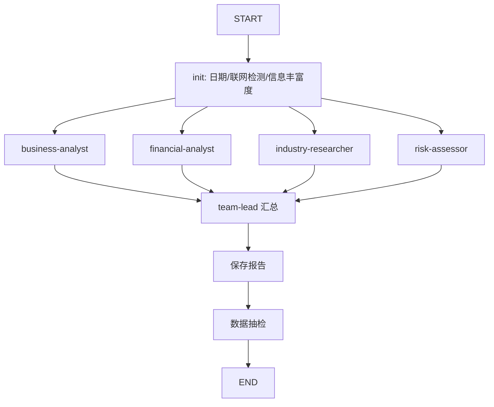

# 投研团队 LangGraph Agent

基于 [investment-team SKILL](file:///c:/Users/Administrator/PycharmProjects/ai-berkshire/codex-skills/investment-team/SKILL.md) 的四角色并行分析框架。

## 架构



## 快速开始

```bash
cd c:\Users\Administrator\Desktop\test\agent
pip install -r requirements.txt
copy .env.example .env
# 编辑 .env，填入 OPENAI_API_KEY

python main.py 四创电子 --stream
```

## SKILL 映射

| SKILL 步骤 | 实现 |
|-----------|------|
| 团队框架展示 | `main.py` 启动打印 |
| 信息丰富度评估 | `init_research` |
| 4 并行 Agent | LangGraph `Send` fan-out |
| team-lead 汇总 | `synthesize_report` |
| 保存报告 | `reports/{公司}投资研究报告_{日期}.md` |
| 数据抽检 | `report_audit.py extract` |

## 目录

```
agent/
├── main.py           # CLI 入口
├── graph.py          # LangGraph 图
├── nodes.py          # 节点逻辑
├── state.py          # 状态定义
├── config.py         # 配置
├── agents/prompts.py # 四角色 Prompt
├── tools/
│   ├── data_fetcher.py     # 按角色采集 backend 数据
│   ├── web_search.py       # Tavily / DuckDuckGo
│   ├── berkshire_tools.py  # financial_rigor / report_audit
│   └── progress.py         # 进度上报
└── reports/          # 输出报告
```
